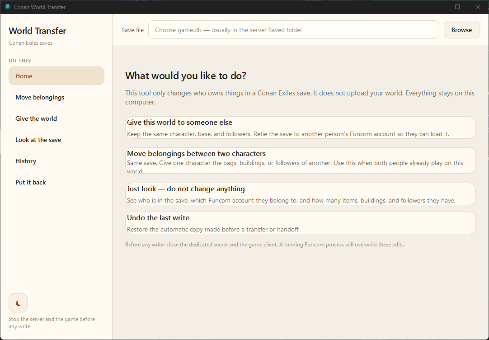

# Conan World Transfer
#### Conan Exiles Enhanced

A calm desktop app for two jobs that look similar and are not:

1. **Give this world to someone else** — keep the same character, base, and followers. Retie the save to another Funcom account.
2. **Move belongings between two characters** — same save. Give one person the bags, buildings, or followers of another.

It is not a generic “find every owner column” rewriter. Funcom stores ownership in a few specific places; only those are touched.

## Screenshot



## Safety

- Close the dedicated server and the game before any write. A live Funcom process overwrites unsaved edits.
- Every write makes `game.db.pre` (one-click restore) and a timestamped `.bak_<unix>` copy, including WAL contents.
- An integrity check runs after the write. If it fails, the `.pre` copy is restored.


## Run

```bash
python3 -m venv .venv
. .venv/bin/activate
pip install -r requirements.txt
python3 main.py
```

Pick `game.db` in the bar at the top. Home asks what you want to do. Dark and light themes switch with one click and are remembered.

## Give the world to someone else

1. Choose Person A’s `game.db` (Siptah’s `dlc_siptah.db` is detected next to it when present).
2. Select the character to keep.
3. Browse Person B’s `Game.ini` so their Master Account ID fills in — or paste it.
  Typical path: `ConanSandbox/Saved/Config/WindowsNoEditor/Game.ini`
4. Preview, then retie.

Belongings stay on the same character id. Only account linkage changes.

## Move belongings

Pick who they come from and who receives them. Tick carried items, buildings, and/or followers. “Choose which…” narrows a category. Clan property is off until you turn it on — other clan members lose shared assets if you do.

Chests and benches move with the building. Only bags, hotbar, and worn gear count as carried items.

## Look / History / Put it back

- **Look** lists characters, accounts, and counts. Nothing writes.
- **History** is a local diary (`transfers_audit.csv` next to the app).
- **Put it back** restores `game.db.pre` for the file in the top bar.


## What the engine actually changes

- Carried items: `item_inventory` / `item_properties` where `owner_id` is the character id.
- Buildings: `buildings.owner_id` is a character id or a clan `guildId`. `0` is unowned and is never touched. `characters.playerId` is an account key, never an owner.
- Followers: last 8 bytes of `OwnerUniqueID` blobs, plus `follower_markers` for the wheel. On clan servers the blob is often the guild id.


## Disclosure

- Some of the GUI was created with assistance from Grok Build.


## License

[MIT](https://opensource.org/license/mit) license. Copyright (c) 2026 dbowlin.